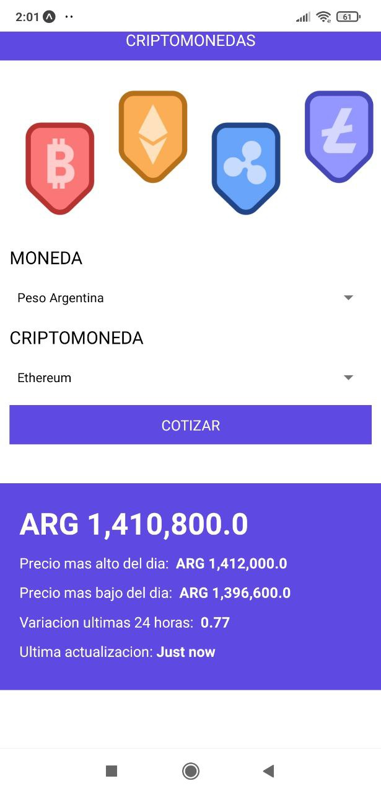

# criptoInfo
App en react-native para ver la cotizacion de las cripto monedas

## Tecnologias Usadas:
1. expo-cli: [Expo Install](https://docs.expo.dev/get-started/installation/)
2. Axios para realizar los request: [Axios](https://axios-http.com/docs/intro)

## Componentes principales
1. App: Componente principal de navegacion.
2. Formulario: Realizamos la consulta a la API [CriptoCompare](https://min-api.cryptocompare.com) con lo que se ingresa en el formulario
3. Cotizacion: Devolvemos los datos que traemos desde la api con un formato agradable para la lectura.

## Vista de la app

